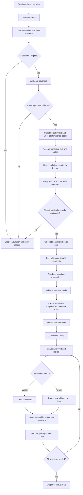

# Incentive Bonuses System — Flow and Calculation Process

## 1. Purpose

This document explains how the current Incentive Bonuses system:

- Determines whether an MMP qualifies.
- Calculates the eligible fee pool.
- Resolves eligible staff.
- Calculates bonuses for each role.
- Handles rounding.
- Pre-approves and locks the calculation.
- Pays bonuses through Wallet or Payroll.
- Reverses Wallet settlements.

The final calculation is performed by the database. Calculations shown in the browser before pre-approval are previews only.

---

## 2. Complete Process Flow



---

## 3. Authoritative Data Sources

| Information | Database source |
|---|---|
| MMP identity, hub, currency and lifecycle | `mmp_files` |
| MMP sites and enumerator fees | `mmp_site_entries` |
| WFP confirmation | `mmp_site_entries.verified_by` |
| Hub and state mapping | `hubs`, `hub_states` |
| Staff identity, roles, hub and state | `profiles` |
| Active staff classifications | `user_classifications` |
| Percentages, thresholds and split methods | `incentive_configs` |
| Manual eligibility decisions | `mmp_incentive_eligibility_overrides` |
| Calculation result | `mmp_incentive_snapshots` |
| Recipient amounts | `mmp_incentive_payments` |
| Wallet or Payroll evidence | `mmp_incentive_settlements` |

The authoritative calculation operation is:

```text
calculate_and_preapprove_mmp_incentives
```

The browser sends the MMP ID and reviewed inclusion or exclusion decisions. It does not send trusted payment amounts, percentages, fee pools, or final recipients.

---

## 4. Configurable Rules

The following values come from `incentive_configs`:

- Whether each role is active.
- Bonus percentage.
- Split method: `equal` or `proportional`.
- Coverage threshold.
- Counting method: `wfp_confirmed` or `submitted`.
- Global configuration or Hub-specific override.

### Current UI defaults

| Role | Active | Bonus percentage | Default split |
|---|---:|---:|---|
| Coordinator | Yes | 10% | Proportional |
| Supervisor | Yes | 7% | Equal |
| Field Operations Manager | No | 5% | Equal |
| Support Team | No | 0% | Equal |

These are defaults, not fixed business constants. An active saved database configuration is authoritative.

---

## 5. MMP Eligibility Checks

Before calculating any money, the server verifies:

1. The MMP exists.
2. The MMP contains at least one site.
3. The MMP is not archived.
4. The MMP is not historical.
5. The MMP is not already closed for a new calculation.
6. The MMP is on or after the current activation cutoff.
7. The MMP does not already have a paid or reversed calculation.
8. Hub and state identities can be resolved.
9. Active roles have valid eligible recipients.
10. The coverage threshold is met.

The current activation cutoff in server logic is:

```text
2026-08-01
```

If any required check fails, the database cancels the entire calculation. It does not create a partial bonus snapshot.

---

## 6. What Counts

Each active role can use one of two calculation bases.

### WFP-confirmed

A site counts when:

```sql
verified_by IS NOT NULL
```

The confirmed fee pool is:

```text
confirmed_fee_pool_cents =
sum(round(enumerator_fee × 100))
for WFP-confirmed sites
```

### Submitted

Every valid MMP site counts, whether or not it has WFP confirmation.

```text
submitted_fee_pool_cents =
sum(round(enumerator_fee × 100))
for all MMP sites
```

### Role-specific calculation pool

```text
role_calculation_pool =
    confirmed_fee_pool, when what_counts = wfp_confirmed
    submitted_fee_pool, when what_counts = submitted
```

Transport fees and general site costs are not part of the current incentive fee-pool formula. The calculation uses `enumerator_fee`.

---

## 7. Coverage Calculation

Coverage is based on WFP confirmation:

```text
coverage percentage =
WFP-confirmed site count ÷ total MMP site count × 100
```

Example:

```text
Total MMP sites       = 95
WFP-confirmed sites   = 80

Coverage = 80 ÷ 95 × 100
         = 84.21%
```

The MMP qualifies when:

```text
coverage percentage >= configured coverage threshold
```

If the threshold is 70%, the example qualifies. If the threshold is 85%, it does not.

The server evaluates the active configuration, including a Hub-specific configuration when one exists.

---

## 8. Recipient Resolution

The server resolves eligibility from:

- Primary profile role.
- Additional roles.
- Active user classifications.
- Hub assignment.
- State assignment.
- Active administrator inclusion or exclusion overrides.

Role and location values are normalized before matching.

### Coordinators

Coordinators are resolved by Hub and state. Each qualifying site state must map to one canonical state in the MMP Hub.

A proportional coordinator calculation fails when a qualifying state has no eligible coordinator.

### Supervisors

Supervisors are resolved within the MMP Hub.

### Field Operations Managers

FOM recipients are resolved within the MMP Hub when the FOM rule is active.

### Support Team

Support Team recipients participate only when the rule is active and the user is explicitly included or has an active inclusion override.

### Multiple roles

One user cannot receive multiple incentive roles in the same calculation. Ambiguous role resolution blocks calculation instead of choosing a role automatically.

---

## 9. Eligibility Overrides

Authorized administrators can:

- Explicitly include a user.
- Explicitly exclude a user.
- Revoke a previous override.

Every override requires a reason.

A Coordinator override must include a valid state. Non-Coordinator roles use Hub scope.

Overrides are stored as evidence and are revoked rather than deleted. A later override change does not rewrite an existing calculation snapshot.

---

## 10. Monetary Precision

All calculations use integer cents.

```text
fee_cents = round(enumerator_fee × 100)
```

Example:

```text
SDG 100.10 = 10,010 cents
```

This prevents floating-point differences between the database, browser, Wallet, Payroll, and exports.

---

## 11. Role Bonus Formula

For a role:

```text
role_bonus_pool_cents =
floor(role_calculation_pool_cents × bonus_percentage ÷ 100)
```

Example:

```text
Eligible fee pool = 900,900 cents
Supervisor rate   = 7%

Supervisor pool =
floor(900,900 × 7 ÷ 100)
= 63,063 cents
= SDG 630.63
```

Each active role has a separate pool. One role's bonus does not reduce another role's pool.

---

## 12. Equal Allocation

Equal allocation divides the role pool across eligible recipients.

```text
base_amount =
floor(role_bonus_pool_cents ÷ eligible_recipient_count)

remainder_cents =
role_bonus_pool_cents % eligible_recipient_count
```

Recipients are sorted by stable `user_id`. The first recipients receive one additional cent until the remainder reaches zero.

### Example

```text
Supervisor pool = 63,063 cents
Supervisors     = 2

Base amount = floor(63,063 ÷ 2)
            = 31,531 cents

Remainder = 63,063 % 2
          = 1 cent
```

Final allocation:

```text
Supervisor 1 = 31,532 cents = SDG 315.32
Supervisor 2 = 31,531 cents = SDG 315.31

Total        = 63,063 cents = SDG 630.63
```

The remainder process guarantees that no cent is lost.

---

## 13. Proportional Coordinator Allocation

For proportional Coordinator bonuses, qualifying sites are grouped by canonical state.

```text
state_fee_pool_cents =
sum(qualifying site fee cents in that state)
```

The Coordinator bonus for the state is:

```text
coordinator_state_pool_cents =
floor(state_fee_pool_cents × coordinator_percentage ÷ 100)
```

If multiple eligible Coordinators cover the same state, that state's pool is split among them using integer-cent division and deterministic remainder distribution.

### Example

```text
North state fee pool = 500,500 cents
Coordinator rate     = 10%

North Coordinator pool =
floor(500,500 × 10 ÷ 100)
= 50,050 cents
= SDG 500.50
```

If one Coordinator covers North, that person receives SDG 500.50.

If two Coordinators cover North:

```text
50,050 ÷ 2 = 25,025 cents each
```

---

## 14. Complete Worked Example

Assume:

- 100 total MMP sites.
- 90 sites are WFP-confirmed.
- Each confirmed site has an enumerator fee of SDG 100.10.
- Counting method is `wfp_confirmed`.
- Coverage threshold is 70%.
- Coordinator rate is 10%, proportional by state.
- Supervisor rate is 7%, equal.
- One Coordinator covers North.
- One Coordinator covers South.
- Two Supervisors cover the Hub.

### Step 1 — Coverage

```text
Coverage = 90 ÷ 100 × 100
         = 90%
```

The 70% threshold is met.

### Step 2 — Fee pool

```text
Fee per confirmed site =
round(100.10 × 100)
= 10,010 cents

Confirmed fee pool =
90 × 10,010
= 900,900 cents
= SDG 9,009.00
```

Assume the sites are distributed as follows:

| State | Confirmed sites | Fee pool |
|---|---:|---:|
| North | 50 | 500,500 cents |
| South | 40 | 400,400 cents |

### Step 3 — Coordinator bonuses

North:

```text
floor(500,500 × 10 ÷ 100)
= 50,050 cents
= SDG 500.50
```

South:

```text
floor(400,400 × 10 ÷ 100)
= 40,040 cents
= SDG 400.40
```

Total Coordinator bonus:

```text
50,050 + 40,040
= 90,090 cents
= SDG 900.90
```

### Step 4 — Supervisor bonuses

```text
Supervisor pool =
floor(900,900 × 7 ÷ 100)
= 63,063 cents
= SDG 630.63
```

Two Supervisors:

```text
Base amount = 31,531 cents
Remainder   = 1 cent
```

Final:

```text
Supervisor 1 = SDG 315.32
Supervisor 2 = SDG 315.31
```

### Step 5 — Total snapshot

```text
Coordinator total = 90,090 cents
Supervisor total  = 63,063 cents

Total bonus =
90,090 + 63,063
= 153,153 cents
= SDG 1,531.53
```

The sum of all recipient payment rows must equal SDG 1,531.53.

---

## 15. Pre-Approval Process

An authorized Admin or Financial Admin starts pre-approval.

The server:

1. Locks the MMP calculation scope.
2. Rechecks MMP eligibility.
3. Loads active configuration.
4. Recalculates coverage and fee pools.
5. Resolves eligible recipients.
6. Applies reviewed exclusions and saved overrides.
7. Calculates role and recipient amounts.
8. Validates totals.
9. Creates or updates the calculation snapshot.
10. Creates recipient payment rows.
11. Stores eligibility and configuration evidence.
12. Sets the snapshot to `pre_approved`.

The operation is atomic. If one step fails, no partial calculation is saved.

---

## 16. Snapshot Lifecycle

```text
calculating
→ pre_approved
→ approved
→ paid
```

Additional terminal or exception statuses:

```text
failed
reversed
```

### Calculating

The server is constructing the snapshot and recipient rows.

### Pre-approved

The calculation is complete and recipient amounts are frozen, but Finance cannot settle it yet.

### Approved

Cycle Close approved and locked the snapshot.

### Paid

All non-excluded recipient payments have valid settlement evidence.

### Reversed

The settlement was compensated under the supported reversal process.

---

## 17. Cycle Close Approval

The MMP close operation is:

```text
close_mmp_and_lock_incentives
```

When Cycle Close runs:

1. The MMP cycle status becomes `closed`.
2. The close actor and timestamp are stored.
3. A `pre_approved` incentive snapshot becomes `approved`.
4. The snapshot receives `approved_at`.
5. The snapshot receives `locked_at`.
6. The calculation can no longer be silently replaced.

If no calculation exists, Cycle Close creates a zero-value skipped record so the missing incentive calculation is explicit and auditable.

---

## 18. Wallet Payment Flow

The settlement operation is:

```text
pay_mmp_incentive
```

Wallet settlement requires:

- Authorized Admin, Super Admin, or Financial Admin.
- Snapshot status `approved` or partially settled `paid`.
- Recipient payment not already paid or reversed.
- Recipient not excluded.
- Bonus greater than zero.

The database:

1. Locks the recipient payment.
2. Checks for an existing settlement.
3. Creates or locks the recipient Wallet.
4. Credits `bonus_amount_cents ÷ 100`.
5. Increases Wallet total earned.
6. Creates a posted Wallet transaction.
7. Creates immutable settlement evidence.
8. Marks the recipient payment `paid`.
9. Marks the snapshot `paid` when no unpaid included recipients remain.

Settlement reference:

```text
mmp-incentive:<payment_id>
```

Retries are idempotent. A repeated request returns the existing settlement instead of crediting the Wallet again.

---

## 19. Payroll Payment Flow

For Payroll settlement, the database:

1. Locks the recipient payment.
2. Checks that the payment is approved and unpaid.
3. Checks for an existing settlement.
4. Creates one Payroll item.
5. Links the item to the incentive payment.
6. Stores immutable settlement evidence.
7. Marks the recipient payment `paid`.

Payroll item values include:

```text
type         = incentive_bonus
amount_cents = calculated bonus amount
currency     = MMP currency
reference_id = incentive payment ID
```

The unique reference prevents duplicate Payroll items during retries.

---

## 20. Wallet Reversal Flow

The reversal operation is:

```text
reverse_mmp_incentive
```

Requirements:

- Authorized Admin, Super Admin, or Financial Admin.
- A non-empty reason.
- Recipient payment is currently `paid`.
- Settlement method is Wallet.
- Wallet contains enough balance to reverse the bonus.

The database:

1. Locks the payment and settlement.
2. Confirms that no reversal already exists.
3. Creates a negative posted Wallet transaction.
4. Reduces Wallet total earned.
5. Stores reversal evidence.
6. Marks the payment `reversed`.
7. Recalculates the snapshot lifecycle.

```text
reversal amount = -bonus amount
```

Reversal reference:

```text
mmp-incentive-reversal:<payment_id>
```

The original Wallet transaction is preserved.

Payroll incentives cannot currently be reversed through this operation. They require the Payroll correction process.

---

## 21. Calculation Integrity Rules

The following must always remain true:

```text
sum(recipient amounts for a role)
= calculated role bonus pool
```

```text
sum(all included recipient amounts)
= snapshot total bonus
```

```text
paid recipient amount
= settlement amount
```

The system also prevents:

- Duplicate active snapshots.
- Duplicate recipient settlements.
- Browser-supplied payment amounts.
- Missing Wallet or Payroll evidence for paid rows.
- Recalculation after payment or reversal.
- Unsupported Wallet reversal without sufficient balance.
- Ambiguous Hub, state, or recipient mapping.

---

## 22. Current Important Differences

### Browser preview versus final calculation

The browser currently performs its own preview calculation. The database recalculates everything during pre-approval.

Therefore:

```text
database result = final authoritative result
```

The preview can differ because:

- The browser may select a global threshold while the server selects a Hub override.
- Browser rounding can differ from deterministic server remainder allocation.
- Browser state matching is less strict than canonical server matching.
- The browser and server may resolve eligibility differently.

### Currency display

The MMP Incentives tab currently formats some values as SDG even though the server stores the actual MMP currency.

### Migration order

The later role-eligibility migration provides four-role support. Production should be checked to confirm that it is the active calculation implementation.

---

## 23. Main Implementation References

### Frontend

- `src/components/mmp/IncentivesTab.tsx`
- `src/pages/IncentivesOverviewPage.tsx`
- `src/pages/IncentiveSettingsPage.tsx`
- `src/types/incentive.ts`

### Database

- `supabase/migrations/20260818_close_mmp_and_lock_incentives.sql`
- `supabase/migrations/20260905_incentive_legacy_evidence_remediation.sql`
- `supabase/migrations/20260906_incentive_system_hardening.sql`
- `supabase/migrations/20260907_mmp_incentive_role_eligibility.sql`
- `supabase/migrations/20260910_wfp_confirmed_fee_gating.sql`

### Tests

- `src/types/__tests__/incentiveRpcContracts.test.ts`
- `supabase/tests/incentive_system_hardening_test.sql`
- `supabase/tests/incentive_system_settlement_fixture_test.sql`
- `supabase/tests/incentive_legacy_evidence_remediation_test.sql`
- `supabase/tests/cycle_close_exception_execution_test.sql`
